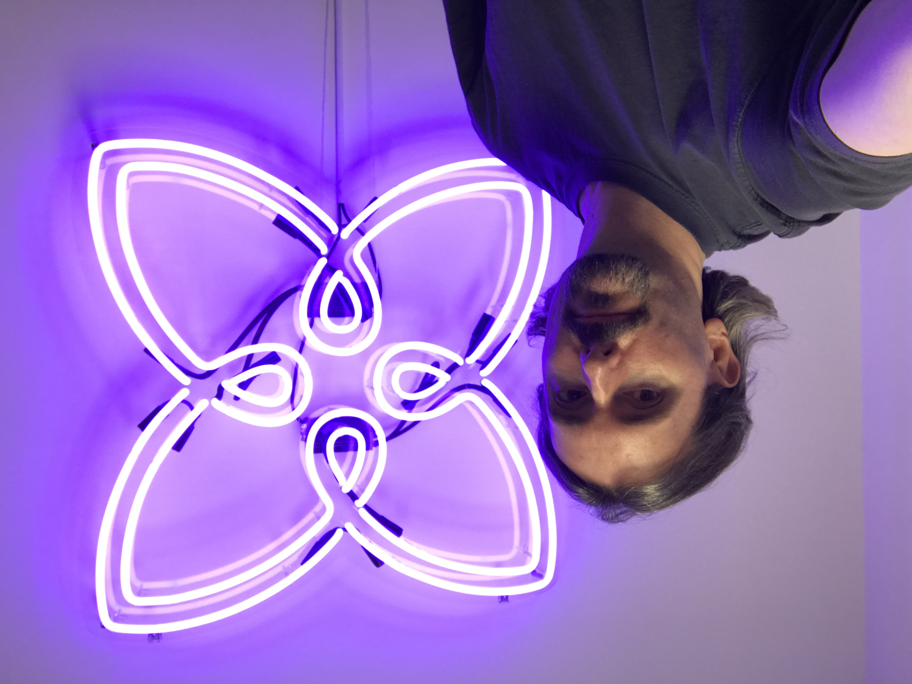
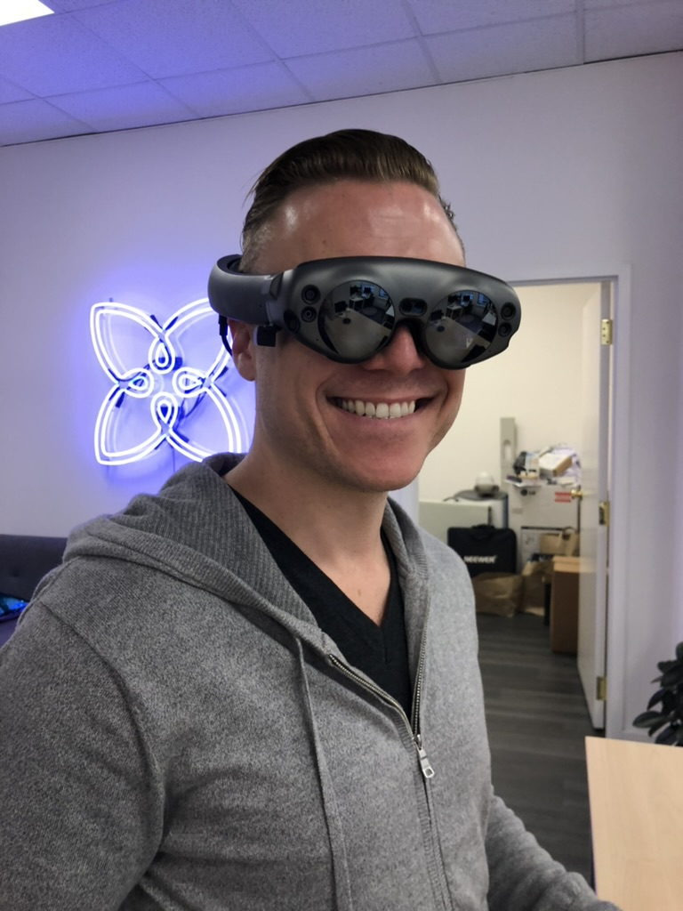

Present
=======

In 2023 we lost our dear friend Bob Lee.  *Present* was his last, big personal project.  It was a novel, location-based social network with features designed by and for women.  This was Bob in a nutshell: He was a brilliant engineer who wanted to make the world a better place for his daughters.  

Present Company was founded as a startup by Bob Lee, Patrick Niemeyer, and Janete Perez and ran from 2015-2020.  This repository is the public release of the source code for the Present mobile apps, web components, and server engines.  The front-ends are native iOS/Swift, Android/Kotlin, and React clients.  The back-end uses Java with google app engine and compute engine on Google's cloud datastore with Objectify. APIs use protocol buffers. It is our hope that open sourcing this code will serve to educate and provide a glimpse into the structure of the codebase of a modern, commercial social platform project from end to end.  This code does not currently build and it would take some effort to get it running fully again, but it contains a wealth of ideas and frameworks.

Photos
======

    
    
    

<h3>Your friends will always love and remember you, Crazybob.</h3>
