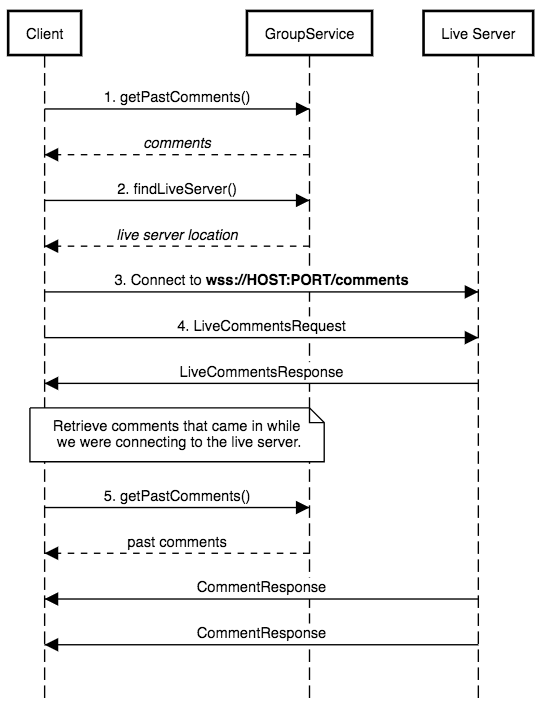

Live Server
===========

## Client

### Protocol

The live server delivers new comments in real time over a web socket. We create one web socket per 
group (or chat).

1. Call [`GroupService.findLiveServer()`](https://github.com/presentco/present/blob/master/proto/present/group.proto) 
to get the host and port for the Live Server for the given group. _Do not cache this result, 
even when reconnecting._

2. Open a web socket connection to `wss://HOST:PORT/comments`.

3. Send a [`LiveCommentsRequest`](https://github.com/presentco/present/blob/master/proto/present/live.proto)
with `version=1`.

4. The server will send a [`LiveCommentsResponse`](https://github.com/presentco/present/blob/master/proto/present/live.proto)
with `status=READY`.

5. The server will send a stream of [`CommentResponse`](https://github.com/presentco/present/blob/master/proto/present/group.proto)
messages. If `deleted=true`, remove the comment.

### Connection Sequence

[Diagram Source Code](https://github.com/presentco/present/blob/master/java/live-server/client.sequence)

## Maintenance

### Get the status of the cluster

    $ ./status.sh [project name]

### Deploy an update

    $ ./deploy.sh [project name]
    
### Create a cluster from scratch

In [the console](https://console.cloud.google.com/projectselector/networking/addresses/list), 
request a static IP address in zone "us-central1". Then:

    $ ./create-cluster.sh [project name] [static IP]
    
### Tail the logs
    
    $ ./log.sh [project name]
    
### Open the Kubernetes dashboard

    $ ./dashboard.sh [project name]
    
## First Time Setup

### Install Docker

    https://docs.docker.com/mac/step_one/

### Install the Cloud SDK

    $ brew install Caskroom/cask/google-cloud-sdk

### Install Kubernetes

    $ gcloud components install kubectl

### Log Into `gcloud`

    $ gcloud auth login 
    
